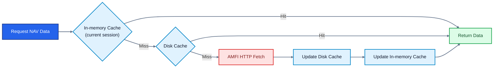

# Fundkit
A modern, async-first Python library for Indian Mutual Fund data, analytics, and portfolio management.
Built on top of AMFI's public data with a typed, developer-friendly API — no third-party data vendors, no black-box calculations.

```python
async with NAVClient(verbose=True) as client:
    nav = await client.get_nav(119597)
    print(nav.scheme_name, nav.nav, nav.date)
```

## Why Fundkit
Most existing Python tools for Indian mutual funds either wrap third-party APIs (mfapi.in, mftool), are synchronous-only, return untyped raw dicts, or have no concept of SIPs, switches, or tax computation.

Fundkit is built differently:

* `Async-first` : built on httpx and asyncio, usable in FastAPI, Django async views, or any modern async app

* `Typed everywhere` : Pydantic v2 models for all domain objects, polars DataFrames with proper schemas for bulk data

* `AMFI-native` - hits AMFI directly, no middlemen that can go down
Polars-first - 10–100x faster than pandas for bulk NAV operations, with optional pandas export
* `No surprises` - explicit caching, clear error messages and honest return types (Everything is strictly typed)

## Installation
```bash
pip install fundkit
```

Optional pandas support
```bash
pip install fundkit[pandas]
```

## Current Status
Fundkit is under active development. The `data/` layer is complete. `schema/`, `portfolio/`, `analytics/`, `tax/`, `sip/`, `compare/` ... modules are in progress.

## Usage
### Current NAV
```python
from fundkit.data.nav_client import NAVClient

async with NAVClient(verbose=True) as client:
    nav = await client.search_scheme_by_code(128628)
    print(f"Scheme Code: {nav['scheme_code'].item()}")  # Scheme Code: 128628
    print(f"ISIN (Growth/Payout): {nav['isin_growth_or_payout'].item()}")  # ISIN (Growth/Payout): INF179KA1JC4
    print(f"ISIN (Div Reinvest): {nav['isin_div_reinvestment'].item()}")  # ISIN (Div Reinvest): -
    print(f"Scheme Name: {nav['scheme_name'].item()}")  # Scheme Name: HDFC Banking and PSU Debt Fund - Growth Option
    print(f"NAV: {nav['nav'].item()}")  # NAV: 23.729
    print(f"Date: {nav['date'].item()}")  # Date: 2026-05-22
    print(f"AMC: {nav['amc'].item()}")  # AMC: HDFC Mutual Fund
    print(
        f"Scheme Type: {nav['scheme_type'].item()}"
    )  # Scheme Type: Open Ended Schemes(Debt Scheme - Banking and PSU Fund)

    # Multiple schemes
    df = await client.search_scheme_by_code([119597, 120505, 108272])

    # Search by name
    results = await client.search_scheme_by_name("bluechip", case_sensitive=False)

    # Search by AMC
    results = await client.search_scheme_by_amc("SBI")

    # Search by fund type
    results = await client.search_scheme_by_type("Open Ended Schemes")

    # Validate scheme code
    is_valid = await client.is_valid_scheme_code(119597)

    # Force refresh cache
    await client.refresh_nav_cache()
```

### Output formats
All bulk methods support both polars (default) and pandas:
```python
df = await store.search_scheme_by_code([119597, 120505], fmt="pandas")
```

## Caching
Fundkit caches data locally to avoid unnecessary network calls.


Cache is stored using platformdirs — on Linux `~/.cache/fundkit/`, on macOS `~/Library/Caches/fundkit/`, on Windows `%LOCALAPPDATA%\fundkit\`.

The table below shows the data for Linux.

| Cache | Location (Platform Native) | TTL Current |
|-------| -------- | ---------- |
| NAV | `~/.cache/fundkit/nav.parquet`| 24 hours|
| Historical  NAV | `~/.cache/fundkit/historical/{scheme_code}.parquet` | Permanent (immutable past data) | 
| Fund house IDs | `~/.cache/fundkit/mf_id_map.json` | 7 days| 

### Caching Hierarchy 

