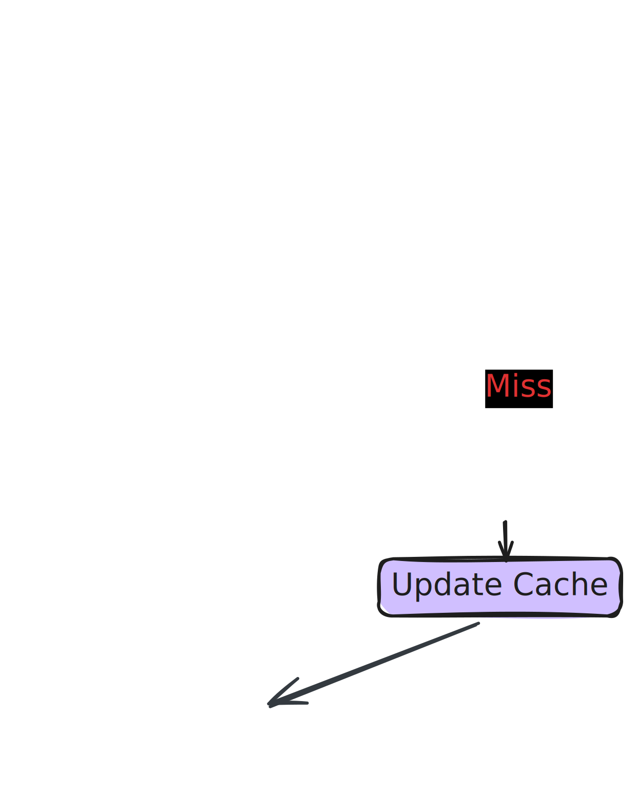

# Fundkit
A modern, async-first Python library for Mutual Fund data, analytics, and portfolio management.

Built on top of AMFI's public data with a typed, developer-friendly API - no third-party data vendors, no black-box calculations.

```python
async with NAVClient() as client:
    nav = await client.search_scheme_by_code(128628)
    print(nav)
```

## Installation
```bash
pip install fundkit
```
OR
```
uv add fundkit
```

## Current Status
Fundkit is under active development. The `data/` layer is complete. `schema/`, `portfolio/`, `analytics/`, `tax/`, `sip/`, `compare/` ... modules are in progress.

## Usage
### Latest NAV data
```python
from fundkit import NAVClient
import asyncio


async def main():

    async with NAVClient(verbose=True) as client:  # verbose = TRUE for logging (defaults to False)
        # ----------- Fetch NAV data for a single scheme ----------
        nav = await client.search_scheme_by_code(128628)
        print("Single Scheme NAV Data")
        print(f"Scheme Code           : {nav['scheme_code'].item()}")
        print(f"ISIN (Growth/Payout)  : {nav['isin_growth_or_payout'].item()}")
        print(f"ISIN (Div Reinvest)   : {nav['isin_div_reinvestment'].item()}")
        print(f"Scheme Name           : {nav['scheme_name'].item()}")
        print(f"NAV                   : {nav['nav'].item()}")
        print(f"Date                  : {nav['date'].item()}")
        print(f"AMC                   : {nav['amc'].item()}")
        print(f"Scheme Type           : {nav['scheme_type'].item()}")
        print()

        # ------------ Fetch NAV data for multiple schemes ---------
        df = await client.search_scheme_by_code([119597, 120505, 108272])
        print(df)

        # ------------ Search scheme by name ----------------------
        results = await client.search_scheme_by_name("bluechip", case_sensitive=False)

        # ------------ Search scheme by AMC -----------------------
        results = await client.search_scheme_by_amc("SBI")

        # ------------ Search scheme by Fund type -----------------
        results = await client.search_scheme_by_type("Open Ended Schemes")
        print(results)

        # ------------ Validate scheme code -----------------------
        is_valid = await client.is_valid_scheme_code(119597)
        print(is_valid)

        # ------------ Force refresh the disk-cache ----------------
        await client.refresh_nav_cache()


asyncio.run(main())
```

### Historical NAV data
```python
from fundkit import HistoricalNAVClient
import asyncio
from datetime import date


async def main():
    # ------------ Search historical NAV data with start-date, end-date default to today ----------------
    async with HistoricalNAVClient(verbose=True) as client:
        data = await client.search_history(124182, start_date=date(2026, 1, 1))
        print(data)

    # ------------ Search historical NAV data with start-date and end-date ----------------
    async with HistoricalNAVClient(verbose=True) as client:
        data = await client.search_history(124182, start_date=date(2025, 1, 1), end_date=date(2026, 3, 31))
        print(data)

    # ------------ Output as pandas dataframe (defaults to polars) ----------------
    async with HistoricalNAVClient(verbose=True) as client:
        data = await client.search_history(124182, start_date=date(2025, 1, 1), df_format="pandas")
        print(data)


asyncio.run(main())
```

### Output formats
All bulk methods support output in both `polars (default)` and `pandas`:
```python
df = await client.search_scheme_by_code([119597, 120505], fmt="pandas")
```


## Caching
Fundkit caches data locally to avoid unnecessary network calls.


Cache is stored using platformdirs — on Linux `~/.cache/fundkit/`, on macOS `~/Library/Caches/fundkit/`, on Windows `%LOCALAPPDATA%\fundkit\`.

The table below shows the data for Linux.

| Cache | Location (Platform Native) | TTL Current |
|-------| -------- | ---------- |
| NAV | `~/.cache/fundkit/nav.parquet`| 24 hours|
| Historical  NAV | `~/.cache/fundkit/historical/{scheme_code}.parquet` | Permanent (immutable past data) | 
| Fund house IDs | `~/.cache/fundkit/mf_id_map.json` | 7 days| 

### Caching Hierarchy 


## Why Fundkit
Most existing Python tools for mutual funds either wrap third-party APIs (mfapi.in, mftool), are synchronous-only, return untyped raw dicts, or have no concept of SIPs, switches, or tax computation.

Fundkit is built differently:

* `Async-first`: Built on httpx and asyncio, usable in FastAPI, Django async views, or any modern async app.

* `Typed everywhere`: Pydantic v2 models for all domain objects, polars DataFrames with proper schemas for bulk data.

* `AMFI-native`: Hits AMFI directly, no middlemen that can go down.

* `Polars-first`: 10–100x faster than pandas for bulk NAV operations, with optional pandas export.