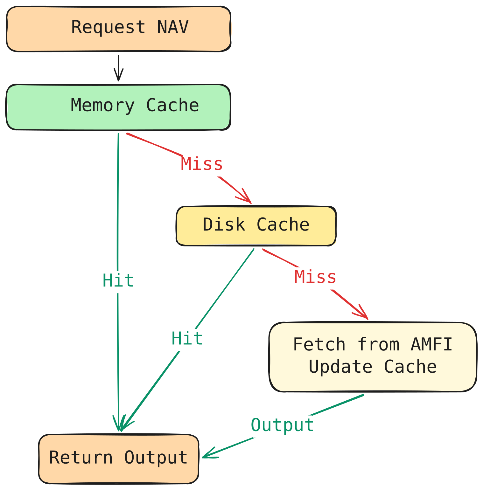

<div align="left">


</div>

<p align="left">
  
  
</p>

---

Async Python library for Indian mutual fund analytics.
FundKit includes native parsers which fetch NAV info directly from [AMFI](https://www.amfiindia.com/) - no third-party APIs.

If you're building dashboards, research pipelines, or backend services that need reliable fund data, FundKit gives you pydantic validated typed DataFrames with sensible caching.

```python
import asyncio
from fundkit import NAVClient


async def main():
    async with NAVClient() as client:
        nav = await client.get_nav(128628)
        print(nav)


asyncio.run(main())
```

## Installation

```bash
pip install fundkit
# or
uv add fundkit
```

Pandas export:

```bash
pip install fundkit[pandas]
```

## Modules

| Area | Status |
|------|--------|
| `data` | NAV, historical NAV, scheme details |
| `schema` | Pydantic models (e.g. `SchemeDetails`) |
| `portfolio`, `analytics`, `tax`, `sip`, `compare`, ... | planned |

| Client | Purpose |
|--------|---------|
| `NAVClient` | Latest NAV by scheme code, name, AMC, or fund type |
| `HistoricalNAVClient` | NAV over a date range |
| `SchemeDetailsClient` | Scheme metadata (category, launch date, minimum investment, ...) |

DataFrame methods default to Polars. Pass `df_format="pandas"` for pandas. `get_scheme_details` returns a `SchemeDetails` model; bulk lookups return a DataFrame.

Shared helpers: scheme validation, code/AMC listing. See the [data module docs](src/fundkit/data/README.md#api-reference).

## Usage

```python
import asyncio
from datetime import date
from fundkit import NAVClient, HistoricalNAVClient, SchemeDetailsClient


async def main():
    async with NAVClient(verbose=True) as client:
        nav = await client.get_nav(128628)
        batch = await client.get_nav([119597, 120505, 108272])

        by_name = await client.get_nav_by_name("bluechip", case_sensitive=False)
        by_amc = await client.get_nav_by_amc("SBI")
        by_type = await client.get_nav_by_type("Open Ended Schemes")

        valid = await client.is_valid_scheme_code(119597)
        schemes = await client.get_scheme_codes(query="bluechip", by="scheme_name")
        amcs = await client.get_amc_list()

    async with HistoricalNAVClient(verbose=True) as client:
        history = await client.get_history(
            124182,
            start_date=date(2023, 1, 1),
            end_date=date.today(),
            df_format="pandas",
        )

    async with SchemeDetailsClient(verbose=True) as client:
        details = await client.get_scheme_details(128628)
        bulk = await client.get_scheme_details_bulk([128628, 119597])


asyncio.run(main())
```

`verbose=True` logs cache hits and network fetches. Architecture, caching, and the full API are in [`src/fundkit/data/README.md`](src/fundkit/data/README.md).

## Compared to typical MF libraries

Many libraries wrap mfapi.in (or similar), use synchronous `requests`, and return dicts or pandas on every call. That is fine for one-off scripts; it is awkward in async apps or when filtering large scheme lists repeatedly.

| | Typical MF libraries | FundKit |
|---|----------------------|---------|
| Data source | Third-party proxy | AMFI |
| Execution | Sync (`requests`) | Async (`httpx`) |
| Default output | Dict / JSON / pandas | Polars DataFrame |
| Bulk filtering | Python loops | Polars |
| Caching | Often none | Memory → disk (parquet) → network |
| Schemas | Untyped dicts | Fixed column names and dtypes |

FundKit does not aim to match every feature elsewhere (performance metrics, JSON export, MCP servers, etc.). The current focus is the data layer.

## Caching

Repeated same-day calls use local cache instead of re-downloading from AMFI.



| Platform | Path |
|----------|------|
| Linux | `~/.cache/fundkit/` |
| macOS | `~/Library/Caches/fundkit/` |
| Windows | `%LOCALAPPDATA%\fundkit\` |

| Data | TTL |
|------|-----|
| Latest NAV | Same calendar day (memory + disk) |
| Historical NAV | Permanent, append-only per AMC |
| Scheme details | 7 days (memory + disk) |

Historical NAV is not re-fetched once cached. Latest NAV refreshes when the calendar day changes.
