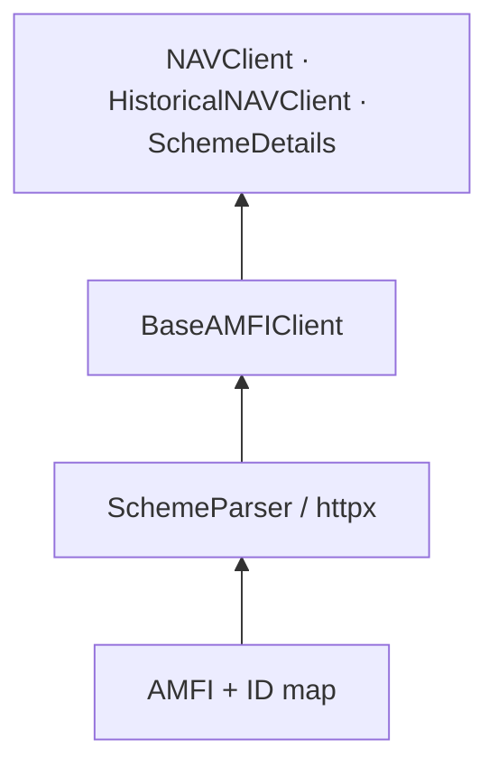
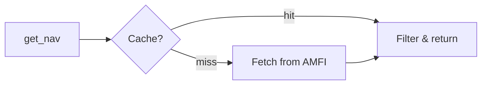
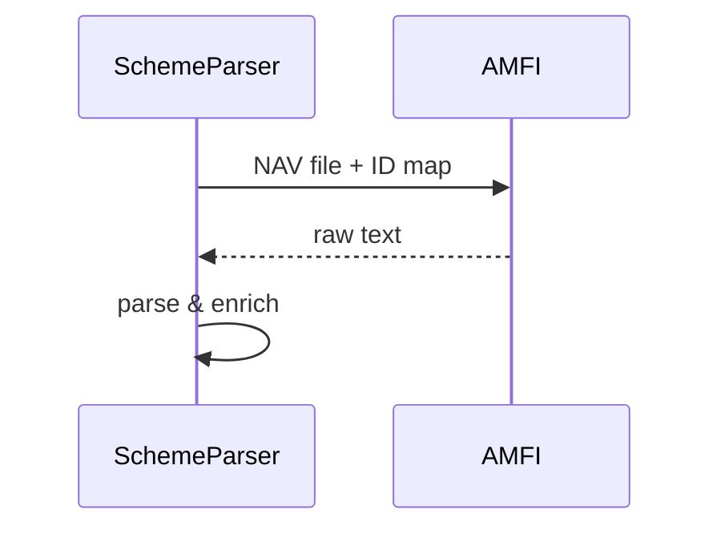

# FundKit Data Module

This package fetches Indian mutual fund data from [AMFI](https://www.amfiindia.com/) (Association of Mutual Funds in India), cleans it up into tidy tables, and gives you a simple async API to query latest NAV, historical NAV, and scheme details.

Everything is **async**, optionally exports to **pandas**, and uses a **three-tier cache** (memory → disk → network) so you don't hit AMFI more than you need to.

---

## What's in here

| File | What it does |
|------|--------------|
| `scheme_parser.py` | Downloads and parses AMFI's daily NAV file |
| `_base_client.py` | Shared caching, search, and export logic |
| `nav_client.py` | Look up today's NAV and search schemes |
| `historical_nav_client.py` | Fetch NAV history for a date range |
| `scheme_details.py` | Scheme metadata (work in progress) |

---

## How it's organized

Think of it as three layers - each one only talks to the layer below it:



**Bottom - Transport & parsing.** `SchemeParser` knows how to read AMFI's semicolon-delimited text. It pulls the daily NAV dump and an AMC name → ID map, then returns a Polars DataFrame. Not part of the public API - clients use it internally.

**Middle - Shared infrastructure.** `BaseAMFIClient` handles caching (`~/.cache/fundkit/` on Linux), building a scheme index, search helpers, and optional pandas export. The NAV table lives in class-level memory, so it's loaded once per day no matter how many clients you create.

**Top - Public clients.** Each client adds methods for a specific job:

- **`NAVClient`** - get NAV by scheme code, name, AMC, or type; force-refresh the cache
- **`HistoricalNAVClient`** - date-range history per scheme (fetches in 89-day chunks, caches per AMC)
- **`SchemeDetails`** - scheme metadata from a separate AMFI endpoint (7-day cache, in progress)

---

## How requests flow

### Latest NAV



Memory first, then today's disk file, then a fresh AMFI download. Results can come back as Polars or pandas.

### Historical NAV


Looks up the scheme's AMC from the daily NAV cache, checks if local history already covers the range, and fetches missing chunks concurrently if not.

### Daily NAV download



Two parallel downloads (NAV dump + AMC ID map), parse into a DataFrame, done.

---

## Caching

| Data | Where | How long |
|------|-------|----------|
| Latest NAV | `nav.parquet` | Same calendar day |
| Historical NAV | `historical/amc_{id}.parquet` | Forever (append-only) |
| Scheme details | `scheme_details.parquet` | 7 days |

Historical cache doesn't use a fixed TTL - if the file already has data close enough to your start date (within 2 days, to cover weekends/holidays), it's reused.

---

## What you get back

**Latest NAV** - `scheme_code`, `scheme_name`, `nav`, `date`, `amc`, `amc_id`, `scheme_type`, ISIN fields

**Historical NAV** - same core columns plus `repurchase_price` and `sale_price`

Both return Polars DataFrames by default. Pass `df_format="pandas"` if you prefer pandas.

---

## API reference

All clients are used as async context managers (`async with NAVClient() as client:`). Every query method accepts an optional `df_format` argument - `"polars"` (default) or `"pandas"`.

### Shared methods

Available on both `NAVClient` and `HistoricalNAVClient` (inherited from `BaseAMFIClient`).

#### `is_valid_scheme_code(scheme_code)`

Check whether a scheme code exists in today's NAV dump.

```python
valid = await client.is_valid_scheme_code(119597)  # True or False
```

#### `get_scheme_codes(query=None, by=None, df_format="polars")`

Return a table of scheme codes and names. Call with no arguments to get every scheme, or pass a filter:

```python
all_schemes = await client.get_scheme_codes()
matches = await client.get_scheme_codes(query="bluechip", by="scheme_name")
exact = await client.get_scheme_codes(query=128628, by="scheme_code")
```

`query` and `by` must be provided together. `by` is either `"scheme_name"` (str query) or `"scheme_code"` (int query).

#### `get_amc_list(df_format="polars")`

Return all Asset Management Companies with their numeric IDs, sorted by `amc_id`.

```python
amcs = await client.get_amc_list()
# columns: amc, amc_id
```

### `NAVClient`

Fetches the latest NAV for all ~15k AMFI-registered schemes. Data refreshes once per calendar day.

**Constructor:** `NAVClient(verbose=False)` - set `verbose=True` to log cache hits and network fetches.

#### `get_nav(scheme_code, suggestion_count=None, df_format="polars")`

Look up NAV by one or more scheme codes. Pass a single `int` or a `list[int]`. Invalid codes are silently skipped; if none are valid, an empty DataFrame is returned.

```python
one = await client.get_nav(128628)
many = await client.get_nav([119597, 120505, 108272])
```

#### `get_nav_by_name(query, suggestion_count=None, case_sensitive=True, df_format="polars")`

Search schemes whose name contains `query`. Set `case_sensitive=False` for a case-insensitive match (usually what you want). Use `suggestion_count` to cap the number of rows returned.

```python
results = await client.get_nav_by_name("bluechip", case_sensitive=False)
top5 = await client.get_nav_by_name("large cap", suggestion_count=5)
```

#### `get_nav_by_amc(query, suggestion_count=None, case_sensitive=True, df_format="polars")`

Filter schemes by Asset Management Company name. Same search semantics as `get_nav_by_name`.

```python
sbi = await client.get_nav_by_amc("SBI")
```

#### `get_nav_by_type(query, suggestion_count=None, case_sensitive=True, df_format="polars")`

Filter schemes by fund type - e.g. `"Open Ended Schemes"`, `"Close Ended Schemes"`.

```python
open_ended = await client.get_nav_by_type("Open Ended Schemes")
```

#### `refresh_nav_cache()`

Force a fresh download from AMFI and overwrite the disk cache, even if today's data is already cached. Useful when you know AMFI has published an updated NAV and don't want to wait for the automatic daily refresh.

```python
await client.refresh_nav_cache()
```

### `HistoricalNAVClient`

Fetches date-range NAV history for a single scheme. AMFI limits each request to 89 days, so longer ranges are split into chunks and fetched concurrently.

**Constructor:** `HistoricalNAVClient(verbose=False, max_concurrency=5, max_retries=3, max_backoff_limit=1.0)`

- `max_concurrency` - how many AMFI requests run in parallel
- `max_retries` / `max_backoff_limit` - retry behaviour on rate limits (429) and server errors (5xx)

#### `get_history(scheme_code, start_date, end_date=None, df_format="polars")`

Return daily NAV rows for `scheme_code` between `start_date` and `end_date` (defaults to today). Resolves the scheme's AMC automatically from the latest NAV cache. Returns an empty DataFrame if the scheme code is unknown.

```python
from datetime import date

history = await client.get_history(124182, start_date=date(2023, 1, 1))
history = await client.get_history(
    124182,
    start_date=date(2023, 1, 1),
    end_date=date(2024, 12, 31),
    df_format="pandas",
)
```

Fetched data is cached permanently per AMC in `historical/amc_{amc_id}.parquet`. Subsequent calls for the same AMC and date range are served from disk.

### `SchemeDetails` *(in progress)*

Will provide scheme metadata (expense ratio, fund manager, benchmark, etc.) from a separate AMFI endpoint. Not yet part of the public API - exported in a future release.

---

## Quick start

```python
import asyncio
from datetime import date
from fundkit import NAVClient, HistoricalNAVClient


async def main():
    async with NAVClient(verbose=True) as client:
        nav = await client.get_nav(128628)
        results = await client.get_nav_by_name("bluechip")

    async with HistoricalNAVClient(verbose=True) as client:
        history = await client.get_history(
            124182,
            start_date=date(2023, 1, 1),
            end_date=date.today(),
        )


asyncio.run(main())
```

---

## Why it's built this way

**Shared NAV cache** - Historical lookups need `scheme_code → amc_id`, which comes from the daily dump. One cache in the base class means no duplicate fetches.

**Separate parsers for latest vs historical** - Different AMFI endpoints, different formats, different rules (89-day windows). Keeping them apart keeps each one simple.

**Polars by default** - Filtering ~15k schemes is much faster. Pandas is opt-in via `df_format="pandas"`.

**Class-level cache** - NAV updates once a day. Sharing state across instances avoids redundant disk reads when you spin up multiple clients in the same app.
