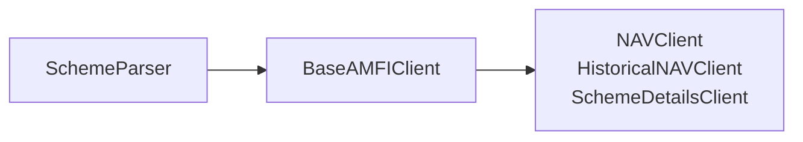
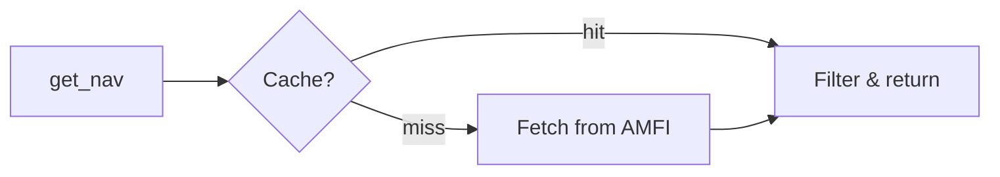

# FundKit data module

Fetches Indian mutual fund data from [AMFI](https://www.amfiindia.com/), parses it into tables, and exposes async clients for latest NAV, historical NAV, and scheme details.

All clients are async. Output is Polars by default; pass `df_format="pandas"` where supported. Cache order: memory -> disk -> network.

## Layout

| File | Client | Role |
|------|--------|------|
| `nav_client.py` | `NAVClient` | Latest NAV and scheme search |
| `historical_nav_client.py` | `HistoricalNAVClient` | NAV history for a date range |
| `scheme_details.py` | `SchemeDetailsClient` | Scheme metadata |
| `scheme_parser.py` | - | Downloads and parses the daily NAV file |
| `_base_client.py` | - | Caching, search helpers, export |

Typed models live in `fundkit.schema` (e.g. `SchemeDetails`).

## Architecture


```mermaid
flowchart LR
    Parser[SchemeParser]
    Base[BaseAMFIClient]
    Clients[NAVClient
    HistoricalNAVClient
    SchemeDetailsClient]

    Parser --> Base --> Clients
```

**`SchemeParser`** - reads AMFI semicolon-delimited text (daily NAV dump + AMC name -> ID map). Internal only.

**`BaseAMFIClient`** - cache under `platformdirs` (e.g. `~/.cache/fundkit/` on Linux), scheme index, search helpers, pandas export. NAV is held at class level so one load per day is shared across client instances.

**Clients** - public API:

- `NAVClient` - NAV by code, name, AMC, or type; force cache refresh
- `HistoricalNAVClient` - date-range history (89-day AMFI chunks, concurrent fetch, per-AMC cache)
- `SchemeDetailsClient` - metadata from a separate AMFI endpoint (7-day cache)

## Request flow

### Latest NAV


```mermaid
flowchart LR
    A[get_nav] --> B{Cache?}
    B -->|hit| C[Filter & return]
    B -->|miss| D[Fetch from AMFI]
    D --> C
```

Memory -> today's disk file -> AMFI download.

### Historical NAV


```mermaid
flowchart LR
    A[get_history] --> B[Resolve AMC]
    B --> C{Cached?}
    C -->|yes| D[Filter & return]
    C -->|no| E[Fetch 89-day chunks]
    E --> D
```

Resolves AMC from the daily NAV cache. Fetches missing 89-day chunks in parallel when needed.

### Scheme details


```mermaid
flowchart LR
    A[get_scheme_details] --> B{Cache?}
    B -->|hit| C[Lookup & return]
    B -->|miss| D[Fetch from AMFI]
    D --> E[Enrich with amc_id]
    E --> C
```

7-day cache. Rows get `amc_id` from the NAV cache. Single lookup -> `SchemeDetails`; bulk -> DataFrame.


## Caching

| Data | File | TTL |
|------|------|-----|
| Latest NAV | `nav.parquet` | Same calendar day |
| Historical NAV | `historical/amc_{id}.parquet` | Append-only, no expiry |
| Scheme details | `scheme_details.parquet` | 7 days |

Historical reuse: if cached data starts within **2 days** of `start_date` (weekends/holidays), the cache is used without refetching that range.

## Output columns

**Latest NAV:** `scheme_code`, `scheme_name`, `nav`, `date`, `amc`, `amc_id`, `scheme_type`, `isin_growth_or_payout`, `isin_div_reinvestment` (plus `scheme_name_lower` for search)

**Historical NAV:** `scheme_code`, `scheme_name`, `nav`, `date`, `isin_growth_or_payout`, `isin_div_reinvestment`, `repurchase_price`, `sale_price`

**Scheme details (single):** `SchemeDetails` - `scheme_code`, `scheme_name`, `scheme_nav_name`, `scheme_type`, `scheme_category`, `amc`, `amc_id`, `isin`, `minimum_amount_raw`, `minimum_amount`, `launch_date`, `closure_date`

**Scheme details (bulk):** same fields as a DataFrame

## API reference

Use clients as async context managers: `async with NAVClient() as client:`.

DataFrame methods accept `df_format`: `"polars"` (default) or `"pandas"`.

### Shared (`BaseAMFIClient`)

On `NAVClient`, `HistoricalNAVClient`, and `SchemeDetailsClient`.

#### `is_valid_scheme_code(scheme_code)`

```python
valid = await client.is_valid_scheme_code(119597)
```

#### `get_scheme_codes(query=None, by=None, df_format="polars")`

```python
all_schemes = await client.get_scheme_codes()
matches = await client.get_scheme_codes(query="bluechip", by="scheme_name")
exact = await client.get_scheme_codes(query=128628, by="scheme_code")
```

`query` and `by` must be used together. `by` is `"scheme_name"` (str) or `"scheme_code"` (int).

#### `get_amc_list(df_format="polars")`

```python
amcs = await client.get_amc_list()
# columns: amc, amc_id
```

### `NAVClient`

Latest NAV for all AMFI schemes (~15k). Refreshes once per calendar day.

**Constructor:** `NAVClient(verbose=False)`

#### `get_nav(scheme_code, suggestion_count=None, df_format="polars")`

`scheme_code`: `int` or `list[int]`. Invalid codes are skipped; all invalid -> empty DataFrame.

```python
one = await client.get_nav(128628)
many = await client.get_nav([119597, 120505, 108272])
```

#### `get_nav_by_name(query, suggestion_count=None, case_sensitive=True, df_format="polars")`

Substring match on scheme name.

```python
results = await client.get_nav_by_name("bluechip", case_sensitive=False)
top5 = await client.get_nav_by_name("large cap", suggestion_count=5)
```

#### `get_nav_by_amc(query, suggestion_count=None, case_sensitive=True, df_format="polars")`

Filter by AMC name (same search options as `get_nav_by_name`).

```python
sbi = await client.get_nav_by_amc("SBI")
```

#### `get_nav_by_type(query, suggestion_count=None, case_sensitive=True, df_format="polars")`

```python
open_ended = await client.get_nav_by_type("Open Ended Schemes")
```

#### `refresh_nav_cache()`

Force a fresh AMFI download and overwrite today's disk cache.

```python
await client.refresh_nav_cache()
```

### `HistoricalNAVClient`

AMFI limits each request to 89 days; longer ranges are split and fetched concurrently.

**Constructor:** `HistoricalNAVClient(verbose=False, max_concurrency=5, max_retries=3, max_backoff_limit=30.0)`

- `max_concurrency` - parallel AMFI requests
- `max_retries` / `max_backoff_limit` - retries on 429 and 5xx (exponential backoff cap)

#### `get_history(scheme_code, start_date, end_date=None, df_format="polars")`

`end_date` defaults to today. Unknown scheme code -> empty DataFrame.

```python
from datetime import date

history = await client.get_history(124182, start_date=date(2023, 1, 1))
history = await client.get_history(
    124182,
    start_date=date(2023, 1, 1),
    end_date=date(2024, 12, 31),
    df_format="pandas",
)
```

Data is stored per AMC in `historical/amc_{amc_id}.parquet`.

### `SchemeDetailsClient`

Separate AMFI endpoint; 7-day memory and disk cache.

**Constructor:** `SchemeDetailsClient(verbose=False)`

#### `get_scheme_details(scheme_code)`

Returns `SchemeDetails` or `None`.

```python
details = await client.get_scheme_details(128628)
if details:
    print(details.scheme_category, details.minimum_amount)
```

#### `get_scheme_details_bulk(scheme_codes, df_format="polars")`

Raises `ValueError` if `scheme_codes` is empty. No matches -> empty DataFrame.

```python
bulk = await client.get_scheme_details_bulk([128628, 119597])
```

## Example

```python
import asyncio
from datetime import date
from fundkit import NAVClient, HistoricalNAVClient, SchemeDetailsClient


async def main():
    async with NAVClient(verbose=True) as client:
        nav = await client.get_nav(128628)
        results = await client.get_nav_by_name("bluechip")

    async with HistoricalNAVClient(verbose=True) as client:
        history = await client.get_history(
            124182,
            start_date=date(2023, 1, 1),
            end_date=date.today(),
        )

    async with SchemeDetailsClient(verbose=True) as client:
        details = await client.get_scheme_details(128628)
        bulk = await client.get_scheme_details_bulk([128628, 119597])


asyncio.run(main())
```

## Design notes

- One shared daily NAV cache feeds historical AMC lookup and scheme-detail `amc_id` enrichment.
- Latest and historical parsers stay separate (different endpoints and chunking rules).
- Class-level NAV cache avoids redundant disk reads when multiple clients run in one process.
- Single scheme details use a frozen Pydantic model; bulk queries stay as DataFrames for joins and filters.
